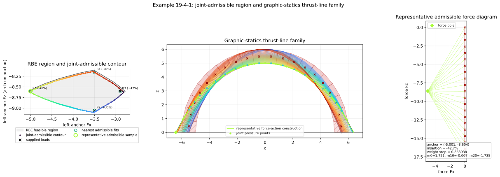
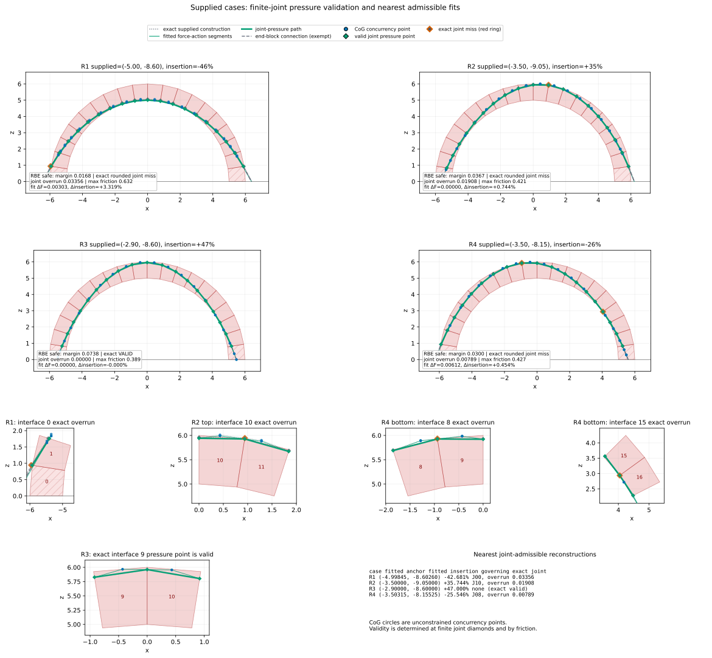

********************************************************************************
Full-Arch RBE Thrust-Line Family
********************************************************************************

This example extends :doc:`19_4_rbe_boundary_failure_modes_arch` with a
two-dimensional graphic-statics visualization. The gray load region comes from
the same tied, compression-only RBE model, while the form-diagram slopes come
from a separate force diagram.

The load plot uses the left-anchor reaction convention. A repository load
``(Fx, Fz)`` on the held rightmost block is displayed as ``(Fx, -Fz)`` at the
left anchor. This anchor vector is the force-diagram pole. A vertical chain of
equal weight steps, each ``0.863938``, supplies the directions of the form
diagram. Commonly scaling all forces does not change those slopes.

Pressure points and CoG concurrency
===================================

The form construction changes direction where the incoming and outgoing
resultant lines meet the vertical weight line through a block center of
gravity. This CoG turning point is a concurrency point used to satisfy block
moment equilibrium. It is not a contact point and does not have to lie inside
the corresponding block or inside the masonry.

The physical check is instead made where each resultant intersects a finite
joint. The classical line of thrust is the locus of these pressure points. This
is consistent with the pressure-point definition in `Block, DeJong, and
Ochsendorf (2006) <https://web.mit.edu/masonry/papers/block_dejong_ochs_NNJ.pdf>`_
and with the distinction between a funicular construction and a joint-pressure
load path discussed by `Alexakis and Makris
<https://journals.sagepub.com/doi/10.1177/10812865231183355>`_.

For each interface, the example calculates an intrados-to-extrados coordinate
``t`` and requires ``0 <= t <= 1`` within ``1e-9``. It also checks that the
normal component is compressive and that
``|Ft| / (0.7 Fn) <= 1``. Straight connections between consecutive pressure
points are drawn as an illustrative thrust path; because each interior block
is convex, a connection whose endpoints lie on its two finite joints remains
inside that block.

Blocks ``0`` and ``19`` may receive external support moments, so the
connections from their external anchors are shown as dashed, moment-exempt
segments. Their physical interfaces with blocks ``1`` and ``18`` are still
checked as finite joints.

Joint-admissible family
=======================

The example traces the maximal joint-admissible component connected to a
verified feasible center. For each of ``360`` polar directions, it intersects
the ray with the convex RBE polygon and advances outward until the joint
insertion interval or friction condition first becomes infeasible. Bisection
locates the final admissible load. All ``360`` points form the colored contour,
while every fourth sample contributes a form construction so that the arch
remains legible.

The representative construction shows three related objects: thin segments
with the force-diagram slopes, neutral-blue CoG concurrency points, and diamond
joint pressure points. The heavier line through the diamonds is the
pressure-point thrust path.

    The enlarged joint-admissible contour and its color-linked family inside
    the gray RBE safe-load region.

Supplied numerical cases
========================

The companion figure reconstructs the supplied numerical values directly; it
does not trace screenshot pixels. All four supplied loads are inside the RBE
region and all their resultant directions satisfy the friction cone. The exact
rounded values produce these finite-joint results:

* ``R1 (-5.0, -8.6), -46%`` passes interface ``0`` by ``0.03356``;
* ``R2 (-3.5, -9.05), +35%`` passes interface ``10`` by ``0.01908``;
* ``R3 (-2.9, -8.6), +47%`` is joint-admissible without adjustment;
* ``R4 (-3.5, -8.15), -26%`` passes interfaces ``8`` and ``15`` by
  ``0.00789`` and ``0.00118`` respectively.

These small discrepancies are shown as rounding-level reconstruction misses,
not as CoG containment failures. The exact constructions remain faintly
visible, and red rings identify only joint pressure points outside a finite
interface. Neutral-blue CoG circles are never ringed.

The green reconstructions are the nearest joint-admissible fits. They are
approximately ``R1 (-4.998449, -8.602601), -42.681%``;
``R2 (-3.5, -9.05), +35.744%``; unchanged ``R3``; and
``R4 (-3.503148, -8.155253), -25.546%``. Supplied and fitted values are
reported separately so that no measured value is silently replaced.

    Four complete reconstructions, zooms of the governing finite joints, and a
    numerical summary of the nearest admissible fits.

.. literalinclude:: 19_4_1_rbe_thrust_line_family_arch.py
    :language: python
